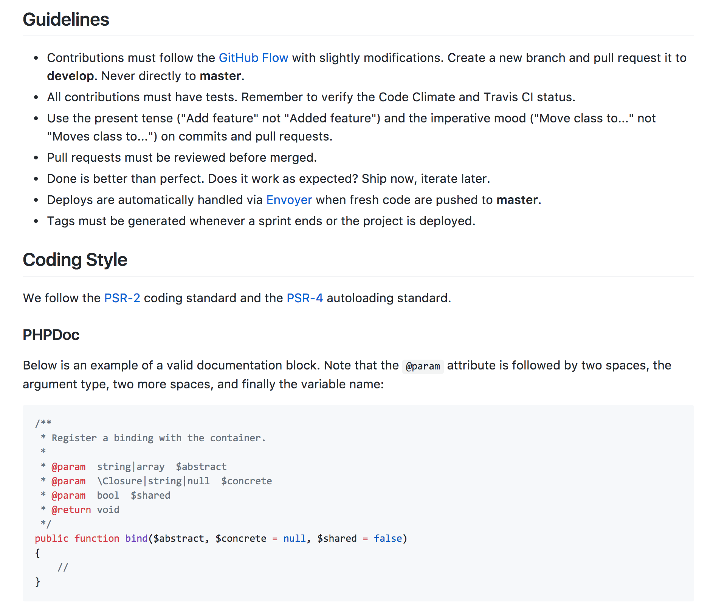

slidenumbers: true

# Workflow e Infra para aplicações Laravel

---

# Quem?!

Gabriel Koerich
26 anos
Formado em administração
Dev PHP há pelo menos 9 anos e Laravel há 5
Co-fundador do Bulldesk, responsável pela área financeira e de tecnologia

---


^ Lançamos o bulldesk em março/2017, hoje estamos com 38 clientes e crescendo uns 18% ao mês

---


---

# Development Workflow & <br>Source Management

--- 

# Development Workflow & Source Management

- Individuals & interactions
- Development Guidelines
- Local Environment
- ~~Database dumps~~ Migrations & Seeds
- Pull Requests / Reviews
- Coding Style, PSRs

^ 1. Mostrar organizacao das pastas, o workflow e ferramentas para desenvolvimento local (trello, breeze / valet, docker / composer, npm), falar sobre os migrations e seeds, que devem estar definidos para qualquer dev novo entrar e não perder muito tempo configurando o projeto em sua máquina. / 

^ 2. Falar como é a estrutura do repositório, variáveis de ambiente (.env), definir quais são os guidelines para desenvolvimento (como é o commit, docblocks, namespaces, PSRs, etc -> php-cs-fixer) e explicar como funciona o processo de review e aceitação de códigos.

^ Ao criar model, criar migration e factory

--- 

# Github Flow

- Anything in master is deployable
- Every new branch should be created off of master and have descritive names (create-cache-mananager, improve-authentication, refactor-)
- Pull requests must be reviewed by at least 2 people


[https://guides.github.com/introduction/flow](https://guides.github.com/introduction/flow)

---



--- 

# Laravel Valet

```bash
# Install PHP/Composer/MySQL/Redis local

$ composer global require laravel/valet

$ cd ~/Projects

$ valet park

# All directories in ~/Projects will be acessible at http://{folder}.dev
```

---

# Vessel (Docker)

```bash
# Install docker

$ composer require shipping-docker/vessel

# Register Vessel\VesselServiceProvide if not on Laravel 5.5

$ php artisan vendor:publish --provider="Vessel\VesselServiceProvider"

$ bash vessel init

$ ./vessel start
```

[vessel.shippingdocker.com](vessel.shippingdocker.com)
[serversforhackers.com](serversforhackers.com)

---

# Continuous Integration

---

# Continuous Integration

- Config (dotfiles)
- Tests
- Code Coverage (>70%)
- Code Quality

^ Falar sobre Travis CI, Clode Climate, Scrutinizer
^ Explicar sobre testes automatizados, cobertura de testes, qualidade de código, integração contínua e mostrar as ferramentas que podem ser utilizadas para ver qualidade, coverage e rodar os testes.

---


---


---

# Provision/Deploy Platforms

---

# Provision/Deploy Platforms

- Continuous Deployment
- *Zero* downtime
- Multi servers/instances
- PHP 7.1
- SSL & http2

^ Falar sobre Forge, Envoyer, Let's Encrypt
^ Mostrar como funciona o provisionamento de máquinas para produção no Forge (sem xdebug, com opcache) e a integração com deploy contínuo com zero downtime no Envoyer, citando que é possível criar vários servidores em rede, cada um fazendo o seu papel para escalar a aplicação.

---


---


---


---


---


---


---


---


---


---

# Next steps 

- Measure *x*% increase on requests using [keen.io](keen.io)
- Automatically provision new app servers using Digital Ocean API and recipes
- Automatically add those servers to the load balancer
- Drop those servers when not needed anymore
- Drop old app servers and spin up new ones every *n*

---

#Monitoring & Security

---

#Monitoring, Security & Optimization

- CDN
- Centralized logs & exceptions
- Notifications
- Backups
- Load tests

^ Falar sobre Cloudflare, Papertrail, Bugsnag, Newrelic, backup jobs and loader.io, beanstalkd console
^ Explicar que os logs devem ser centralizados no mesmo serviço, já que eles vêm de várias máquinas diferentes. Dizer que é interessante logar tudo o que acontece no app para facilitar o debug. Falar sobre o monitoramento via Newrelic, logs via Papertrail e exceptions centralizadas no Bugsgnag. Testes de carga no loader.io

---

Newrelic stuff

---

Digital Ocean Monitoring stuff

^ Como as coisas não são tão belas assim no mundo real, o Newrelic acabou alterando a plataforma deles e cancelando o plano free antigo. O meu dura até por agora em novembro, mas felizmente, para salvar a vida de todos os pobres (brasileiros) desse mundo, o Digital Ocean lançou o seu monitoring, que é muito simples de ser instalado.

^ mostrar o script install

---

# Digital Ocean Monitoring

```bash
$ curl -sSL https://agent.digitalocean.com/install.sh | sh
```
<br>
Na ilha formosa, cheia de graça, o time da raça
É povo é gente, é bola pra frente
É só coração, o meu Avaí
Avaí meu Avaí, da ilha és o Leão
Avaí meu Avaí, tu já nasceste campeão

---

DO Monitoring screenshot

---


---

Cloudflare stuff

---

```php
/**
 * Get the path to a versioned asset file.
 *
 * @param  string $asset
 * @return string
 */
function versioned($asset)
{
    static $production, $base, $deploy, $sha;

    $production = app()->environment('production');

    if (is_null($base)) {
        $base = $production ? 'https://static.bulldesk.com.br/' : '/';
    }

    if ($production === false) {
        return $base.$asset . '?v=' . str_random(3);
    }

    if (is_null($deploy)) {
        $deploy = public_path('build/deploy');
    }

    if (is_null($sha) && file_exists($deploy)) {
        $sha = file_get_contents($deploy);
    }

    if (! empty($sha)) {
        return $base.$asset . '?v='.$sha;
    }

    return $base.$asset;
}

// Use:
<link href="{{ versioned('build/styles/app.css') }}" rel="stylesheet">
<script type="text/javascript" src="{{ versioned('build/scripts/app.js') }}"></script>
```

---


---


<!--


-->

---

#move this to Deployment

```php
//...
'connections' => [

    'mysql' => [
        'write' => [
            'host' => env('DB_WRITE_HOST', env('DB_HOST', '127.0.0.1')),
        ],

        'read' => [
            'host' => [
                env('DB_WRITE_HOST', env('DB_HOST', '127.0.0.1')),
                env('DB_READ_HOST', env('DB_HOST', '127.0.0.1')),
            ],
        ],

        'backup' => [
            'host' => env('DB_BACKUP_HOST', env('DB_READ_HOST', '127.0.0.1')),
            'arguments' => '--single-transaction --skip-tz-utc',
        ],
    //...
];
```

---


---

```php
(...)

/**
 * Execute the backup command.
 *
 * @return void
 */
public function handle()
{
    $database = $this->option('database') ?: 'mysql';
    $destination = $this->option('destination') ?: 's3';
    $destinationPath = 'dump_'. (new Carbon)->format('Y_m_d_H_i_s').'.sql';
    $compression = 'gzip';

    $this->info('Dumping database and uploading...');

    $destinations = [new Destination($destination, $destinationPath)];

    $this->backupProcedure->run($database, $destinations, $compression);

    $completePath = 'database/' . $destinationPath;

    $this->info(sprintf('Successfully dumped %s, compressed with %s and store it to %s at %s',
        $database,
        $compression,
        $destination,
        $completePath
    ));

    $last = new Carbon('last day of this month');

    // Delete file in 10 days if this not the last day in month.
    if ((new Carbon)->isSameAs('d/m/Y', $last)) {
        $this->info('Scheduled job to delete the backup file ' . $completePath . ' in 10 days.');

        dispatch((new DeleteFile($completePath . '.gz', 's3_backup'))->delay(24 * 60 * 60 * 10));
    }
}
```

---

# Backups

```bash
$ composer require backup-manager/backup-manager 

# OR
$ composer require backup-manager/laravel

# OR
$ composer require spatie/laravel-backup
```

[https://docs.spatie.be/laravel-backup](https://docs.spatie.be/laravel-backup)

^ Na época instalei o backup-manager e não queria ficar refém de um package laravel por causa das atualizações / precisava de umas opções a mais para o backup do innoDB. Mas hoje acho que o melhor e mais configurável é o laravel-backup

---

# Lições aprendidas

---

# 1. Não otimize ou escale prematuramente, mas esteja preparado pra isso

---

# 2. Não crie abstrações desnecessárias

---

# 3. Use micro serviços somente se puder dar manutenção à eles

---

# 4. Seja cético em relação aos novos *trends*

---

# 5. Aprenda sozinho e aproveite tudo o que a internet de dá de graça

---


---


  

 

 

 

---


# PHP Sucks

^ Pessoal, agora um assunto muito sério. Todo mundo aqui foi zoado pelo menos uma vez na vida por usar PHP. Que php é lixo, as funções não seguem nenhum padrão e que é realmente muito fácil ver código lixo em php. Mas será que o PHP é tão ruim assim? Na verdade, até a versão 5.2 era muito ruim mesmo. Nem namespace a gente tinha. Até a 5.3 a gente tinha que escrever array LITERALMENTE escrevendo array(). 

---


# PHP Sucks?!

^ O php começou como uma linguage de template. Foi assim que o Rasmus imaginou o PHP. A verdade é que o PHP é muito simples e deixa fazer o que você quiser. Quem tem que ser bom é você. Quem tem que usar os padrões é você. Com o laravel é a mesma coisa, ele te deixa fazer um MONTE de merda. Eu já vi código em Laravel pior que código em Wordpress.
^ Mas sério, muita coisa mudou de lá pra cá, e a partir da versão 7 eu finalmente acho que os desenvolvedores PHP serão cada vez mais valorizados. O futuro é lindo pra gente. 

---

> With great power comes great responsibility
-- Clarice Lispector


---


---

# Referências

---