slidenumbers: true
build-lists: true

# DevOps in PHP environment

^ Hoje vamos falar sobre:
^ Ambientes semelhantes de 2 empresas diferentes
^ Maneiras diferentes de resolver o mesmo Problema


---

# Who?!

Gabriel Koerich
Administrator
PHP Developer over 9 years and 5 years as Laravel
Co-founder of Bulldesk, responsible for finance and technology

[gabriel@bulldesk.com.br](mailto:gabriel@bulldesk.com.br)
[twitter.com/gabrielmkoerich](https://twitter.com/gabrielmkoerich)

---

# Who?!

Evaldo Felipe
8 years of SysAdmin
2,5 years of DevOps

[contato@evaldofelipe.com](mailto:contato@evaldofelipe.com)
[twitter.com/evaldofelipe](https://twitter.com/evaldofelipe)


---


^ G.

^ O Bulldesk é um software de automação de marketing e CRM, nele é possível criar formulários, landing pages, automações de marketing, e-mail marketing e ter uma visão geral de todas as negociações com seus clientes.

^ Aplicação multi tenant, com uns 600 usuários acessando por mes

^ Lançamos o bulldesk em março deste ano e temos uma média de 4.000.000 de requests por mês.

---

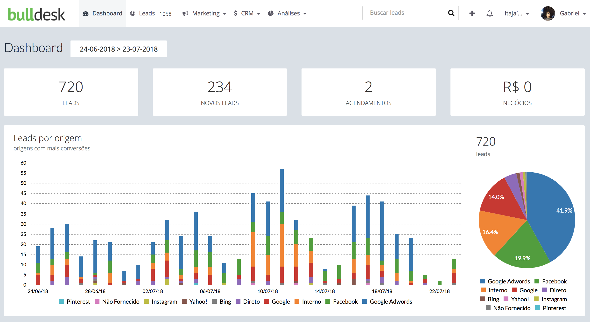

---


---

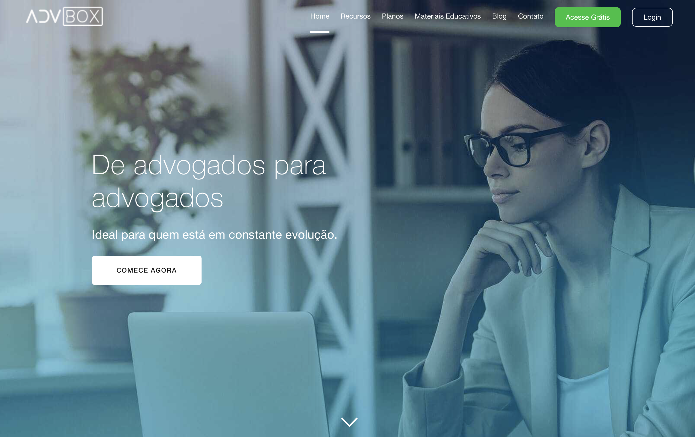

^ E.

^ Aplicação voltada para o meio juridico, para gestão de processos, organização de tarefas do time, gestão do escritório, atualização automatizada dos processos em atividade (explicar alguns detalhes)

^ Versão free e versão com xxx usuários, com 9.000.000 de requests/semana

---

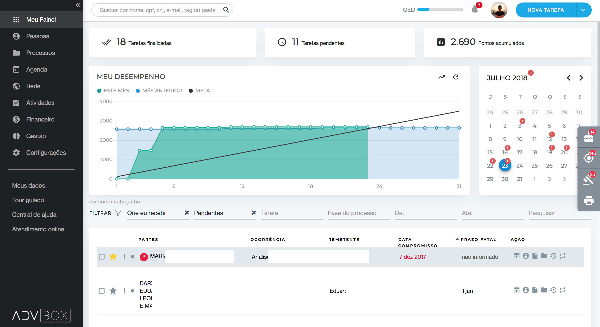

---


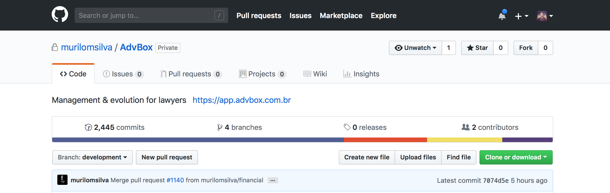

---
# Agenda

- PHP Sucks?!
- Workflow
- Infrastructure
- Tools
- Issues and Fixes

^ E.
<!--
- Dev workflow / Source Management
- Continous Integration
- Deploy Platforms
- Monitoring, Security & Optimization
 -->

---

# PHP Sucks?!

^ G.

---

<!--  -->

# PHP Sucks?!

- Easy for beginners
- Easy to "deploy"
- PHP mixed in HTML
- No conventions for function names
- Wordpress

^ G.
^ Pessoal, agora um assunto sério. Todo mundo aqui foi zoado pelo menos uma vez na vida por usar PHP. Que php é lixo, as funções não seguem nenhum padrão e que é realmente muito fácil ver código lixo em php. Mas será que o PHP é tão ruim assim? Na verdade, até a versão 5.2 era muito ruim mesmo. Nem namespace a gente tinha. Até a 5.3 a gente tinha que escrever array LITERALMENTE escrevendo array().

---

<!--  -->

# PHP Sucks?!

|Version|Changes|
|:---:|---|
|< 5.3 | Trash
|5.3   | Namespaces, closures
|5.4   | Traits, [] for arrays
|5.5   | OPCache, finally on try blocks
|5.6   | Argument unpacking (...$args)
|~~6.0~~   | ???
|7.0   | Performance (thanks to HHVM), return and scalar types, improved exceptions
|7.1   | Nullable types (?int), catch multiple exceptions
|7.2   |  

^ G.
^ O php começou como uma linguage de template. Foi assim que o Rasmus imaginou o PHP. A verdade é que o PHP é muito simples e deixa fazer o que você quiser. Quem tem que ser bom é você. Quem tem que usar os padrões é você. Com o laravel é a mesma coisa, ele te deixa fazer um MONTE de merda. Eu já vi código em Laravel pior que código em Wordpress.
^ Mas sério, muita coisa mudou de lá pra cá, e a partir da versão 7 eu finalmente acho que os desenvolvedores PHP serão cada vez mais respeitados/valorizados.

---

> With great power comes great responsibility

---

# Laravel Framework

- Routes & Controllers
- Service Container & DI
- Migrations & Eloquent ORM
- Artisan command line
- Queues (beanstalkd, redis, amazon sqs)
- Broadcasting (Pusher or socket.io)
- Laravel Mix for webpack

^ G.

---


---

# Development Workflow & <br>Source Management

---

# Development Workflow & Source Management

- Individual and interactions
- Workflow, rules, code patterns, PSRs
- Local environment
- ~~Dump database~~ Migrations / Seeds

^ G.

^ Um projeto é feito por pessoas, por isso os indivíduos e suas interações são a parte mais importante de todo o desenvolvimento de software. Claro que não podemos esquecer dos processos, são eles que nos fazem continuar no caminho certo, mas as pessoas sempre vêm em primeiro lugar.

^ Nós vamos falar também sobre as diretrizes de desenvolvimento, como cada dev deve se portar ao desenvolver e comitar códigos novos para sua aplicação.

^ Como configurar seu ambiente local, o modo como vão instalar o repositório e rodar todos os migrations e seeds. Nenhum dev deve receber o dump de seu banco de dados de produção. Uma dica interessante é ao criar um novo model/migration, criar também um factory e um novo seed.

^ Tudo isso deve estar bem definido para qualquer dev novo entrar e não perder muito tempo configurando o projeto em sua máquina.

---

# Github Flow

- Anything in master is deployable
- Every new branch should be created off of master
- Branches must have descriptive names (create-cache-manager, improve-auth, refactor-acl)
- Pull requests must be reviewed by at least 2 people
- When ready, you should merge and deploy immediately

^ E.

---

# Github Flow


---


---

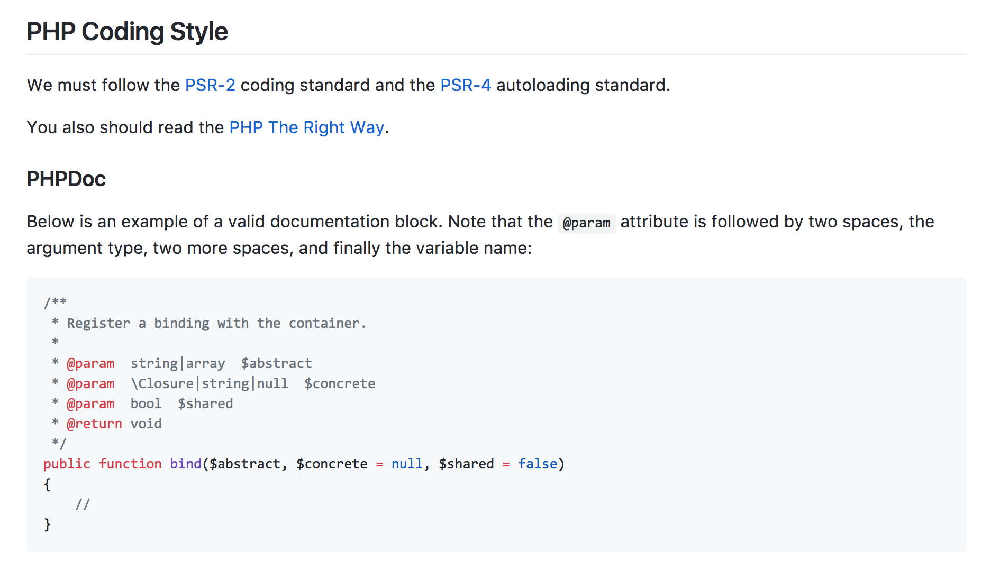

---

# Continuous Integration

^ G.

---

# Continuous Integration

- Config (.env, dotfiles)
- Automated Testing
- Code coverage
- Code quality

^ G.
^ Falar sobre Travis CI, Clode Climate, Scrutinizer
^ Explicar sobre testes automatizados, cobertura de testes, qualidade de código, integração contínua e mostrar as ferramentas que podem ser utilizadas para ver qualidade, coverage e rodar os testes.

---


---

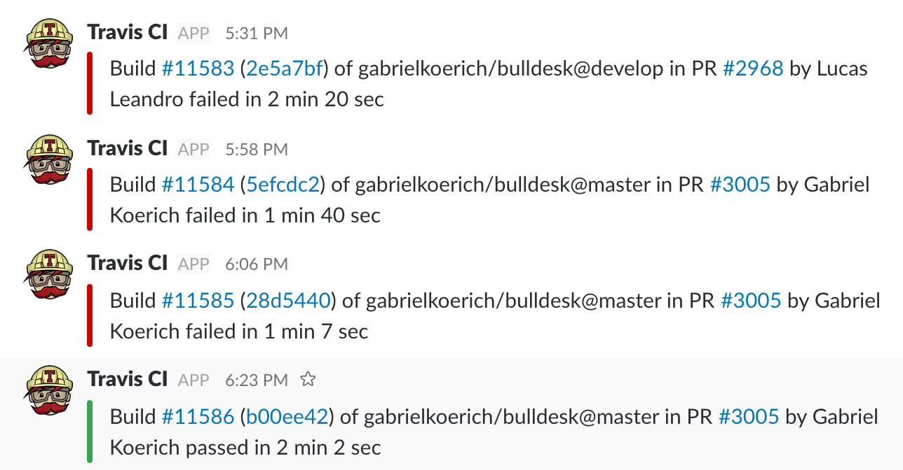

---

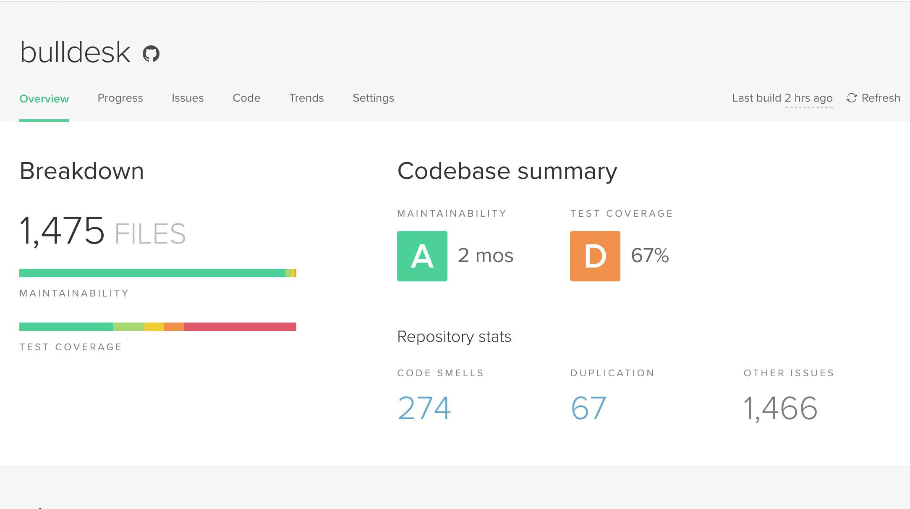

---

# Provision/Deploy

---

# Environment Local

---

# Laravel Valet

```bash
# Install PHP/Composer/MySQL/Redis local

# On MacOS
$ composer global require laravel/valet

# On Linux
$ composer global require cpriego/valet-linux

$ valet install

$ cd ~/Projects && valet park

# All directories in ~/Projects will be acessible at http://{folder}.dev
```

^ E.
^ Falar da evolução do ambiente local

---

# Vessel (Docker)

##PHP 7.2, MySQL 5.7, Redis & NodeJS with NPM, Yarn & Gulp

```bash
# Install docker

$ composer require shipping-docker/vessel

# Register Vessel\VesselServiceProvide if not on Laravel 5.5

$ php artisan vendor:publish --provider="Vessel\VesselServiceProvider"

$ bash vessel init

$ ./vessel start

# Acessible at http://localhost
```

^ G.
^ Esse cara que fez o Vessel é o fideloper...

---

# Production/QA Environment

---

# Forge

- Infrastructure automation as a Service
- PHP environment as a Service

^ E.
^ Falar sobre Forge, Envoyer, Let's Encrypt
^ Mostrar como funciona o provisionamento de máquinas para produção no Forge (sem xdebug, com opcache) e a integração com deploy contínuo com zero downtime no Envoyer, citando que é possível criar vários servidores em rede, cada um fazendo o seu papel para escalar a aplicação.

---


---

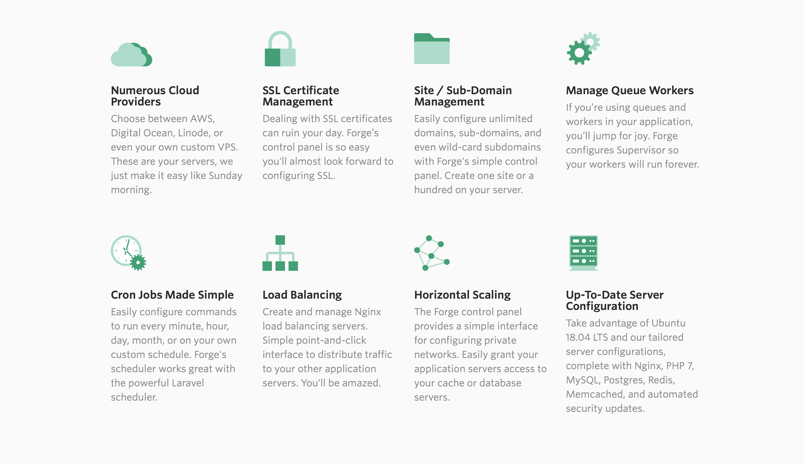

---


---

# Recipes


---


---

```bash
ACCEPT     tcp  --  10.132.103.204       anywhere             tcp dpt:mysql
ACCEPT     udp  --  10.132.103.204       anywhere             udp dpt:mysql
ACCEPT     tcp  --  10.132.103.204       anywhere             tcp dpt:postgresql
ACCEPT     udp  --  10.132.103.204       anywhere             udp dpt:postgresql
ACCEPT     tcp  --  10.132.103.204       anywhere             tcp dpt:11211
ACCEPT     udp  --  10.132.103.204       anywhere             udp dpt:11211
ACCEPT     tcp  --  10.132.103.204       anywhere             tcp dpt:6379
ACCEPT     udp  --  10.132.103.204       anywhere             udp dpt:6379
ACCEPT     tcp  --  10.132.103.204       anywhere             tcp dpt:11300
ACCEPT     udp  --  10.132.103.204       anywhere             udp dpt:11300
```


---


---


---

# Issue

## Laravel doesn't understand that the request came from the client and not from the load balancer


^ G.

---

# Trusted Proxy

```bash
$ composer require fideloper/proxy

# Register Fideloper\Proxy\TrustedProxyServiceProvider

$ php artisan vendor:publish --provider="Fideloper\Proxy\TrustedProxyServiceProvider"
```

```php
// Http/Kernel.php
protected $middleware = [
    //...
    \Fideloper\Proxy\TrustProxies::class,
];

// config/trustedproxy.php
return [
    'proxies' => [
        '192.168.10.10', // Load balancer's IP address
    ],
//...
```

---

# Issue

## How to serve static files from a single server?

---

# Nginx Proxy

```bash
upstream static {
    least_conn;
    server 10.xx.xx.xx:80;
}

upstream websocket {
    least_conn;
    server 10.xx.xx.xx:2095;
}
```

^ G.
^ Websocket/redis

---

# Nginx Proxy

```bash
location ~* \.(css|js|png|jpg|woff|ttf)$ {
    #return 301 $scheme://static.bulldesk.com.br$request_uri;
    proxy_pass http://static;
    proxy_http_version 1.1;
    proxy_set_header Upgrade $http_upgrade;
    proxy_set_header Connection upgrade;
    proxy_set_header Host $host;
}

location /socket.io {
    proxy_pass http://websocket;
    proxy_http_version 1.1;
    proxy_set_header Upgrade $http_upgrade;
    proxy_set_header Connection "upgrade";
    proxy_set_header Host $host;

    proxy_connect_timeout       300;
    proxy_send_timeout          300;
    proxy_read_timeout          300;
    send_timeout                300;
}
```

---

# .env

```
REDIS_HOST=
BEANSTALKD_HOST=

DB_HOST=
DB_WRITE_HOST=
DB_READ_HOST=
DB_BACKUP_HOST=

DB_NAME=
DB_USER=
DB_PASSWORD=

CACHE_DRIVER=redis
SESSION_DRIVER=redis
```

^ E.

---

# Config

```php
//...
'connections' => [

    'mysql' => [
        'write' => [
            'host' => env('DB_WRITE_HOST', env('DB_HOST', '127.0.0.1')),
        ],

        'read' => [
            'host' => [
                env('DB_WRITE_HOST', env('DB_HOST', '127.0.0.1')),
                env('DB_READ_HOST', env('DB_HOST', '127.0.0.1')),
            ],
        ],

        'backup' => [
            'host' => env('DB_BACKUP_HOST', env('DB_READ_HOST', '127.0.0.1')),
            'arguments' => '--single-transaction --skip-tz-utc',
        ],
    //...
];
```

^

---

# Beanstalkd queues + Supervisor

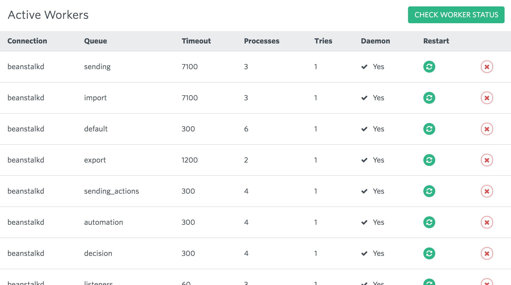

^ G.

---

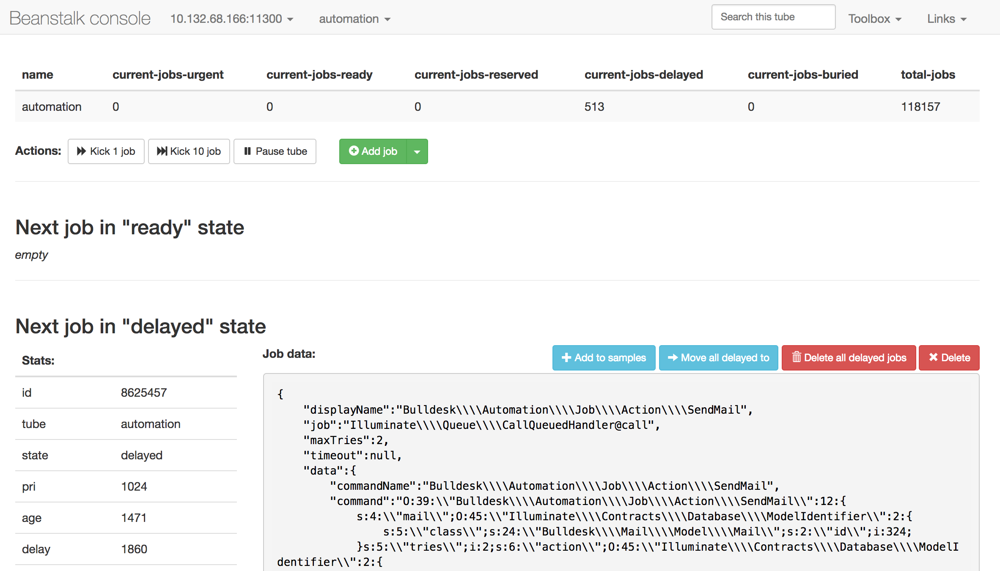

---


---


---


---


---

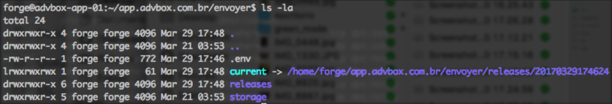

---

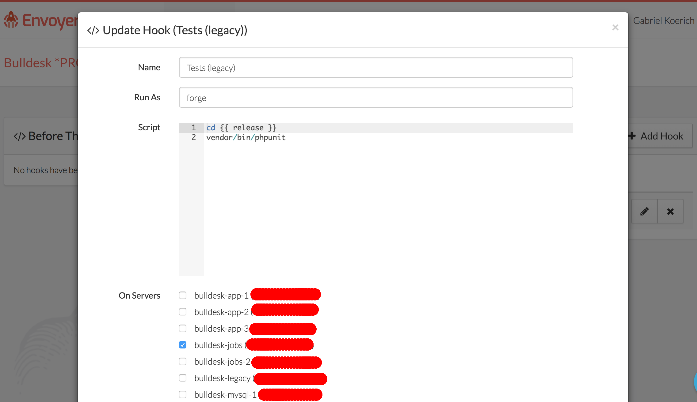

---

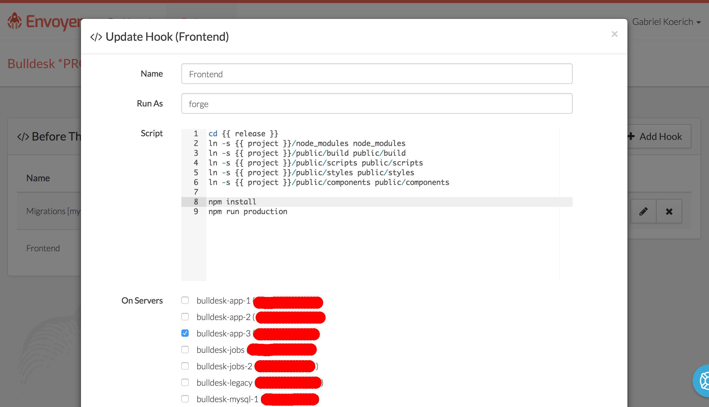

---


---

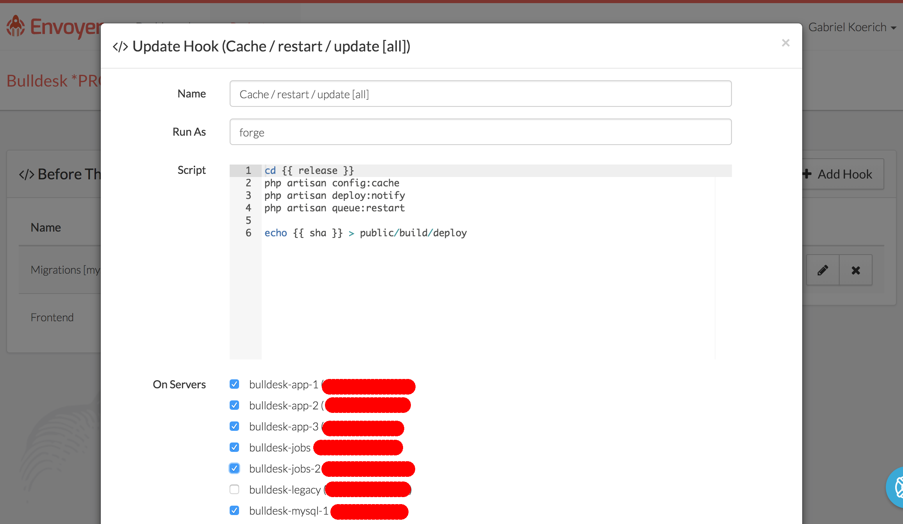

---

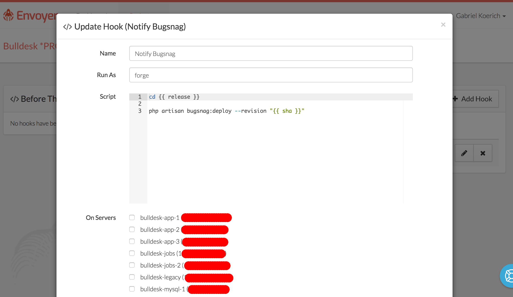

---

# Composer scripts

```json
"scripts": {
    "post-install-cmd": [
        "Illuminate\\Foundation\\ComposerScripts::postInstall",
        "php artisan config:clear",
        "php artisan route:clear",
        "php artisan route:scan",
        "php artisan route:cache",
        "php artisan optimize"
    ],
    "post-update-cmd": [
        "Illuminate\\Foundation\\ComposerScripts::postUpdate",
        "php artisan route:clear",
        "php artisan config:clear",
        "php artisan ide-helper:generate",
        "php artisan optimize"
    ]
},
```

---

# Provision/Deploy

- Continuous Deploy
- no downtime
- Multi Servers / Instances
- PHP 7.2
- SSL & http2

---

#Monitoring, Security & Optimization

---

#Monitoring, Security & Optimization

- CDN
- Monitors
- Logs e exceptions centralized
- Backups
- Load tests

^ Falar sobre Cloudflare, Papertrail, Bugsnag, Newrelic, backup jobs and loader.io, beanstalkd console
^ Explicar que os logs devem ser centralizados no mesmo serviço, já que eles vêm de várias máquinas diferentes. Dizer que é interessante logar tudo o que acontece no app para facilitar o debug. Falar sobre o monitoramento via Newrelic, logs via Papertrail e exceptions centralizadas no Bugsgnag. Testes de carga no loader.io

---


^ G.

---


^ E.

---

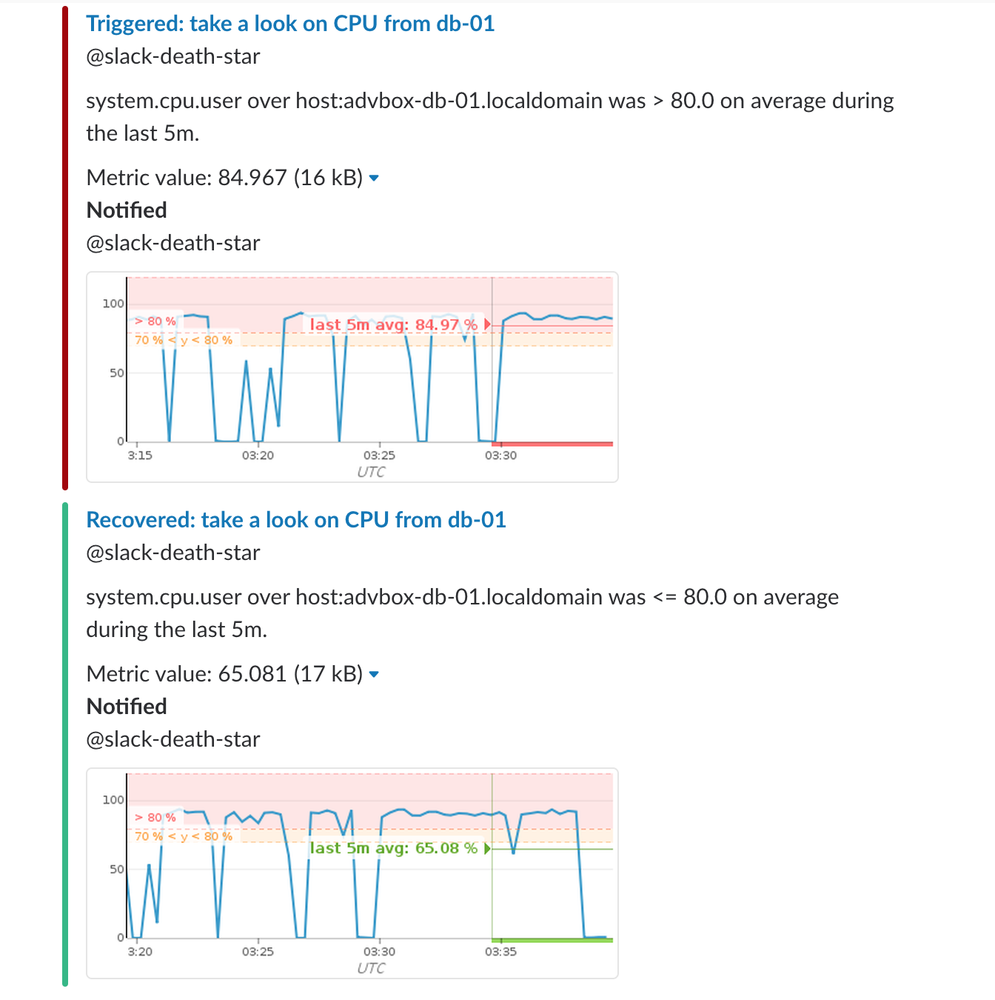

---

# Digital Ocean Monitoring

```bash
$ curl -sSL https://agent.digitalocean.com/install.sh | sh
```

^ G.
^ Como as coisas não são tão belas assim no mundo real, o Newrelic acabou alterando a plataforma deles e cancelando o plano free antigo. O meu dura até por agora em novembro, mas felizmente, para salvar a vida de todos os pobres (brasileiros) desse mundo, o Digital Ocean lançou o seu monitoring, que é muito simples de ser instalado.

^ mostrar o script install

---

# Digital Ocean Monitoring

```bash
$ curl -sSL https://agent.digitalocean.com/install.sh | sh
```
<br>
Na ilha formosa, cheia de graça, o time da raça
É povo é gente, é bola pra frente
É só coração, o meu Avaí
Avaí meu Avaí, da ilha és o Leão
Avaí meu Avaí, tu já nasceste campeão

---

# Digital Ocean Monitoring


---

# Digital Ocean Monitoring


---

# Digital Ocean Monitoring


---


---


---

```php
/**
 * Set the CloudFlare conneting IP and https if applied.
 *
 * @param  \Illuminate\Http\Request $request
 * @param  \Closure                 $next
 * @return mixed
 */
public function handle($request, Closure $next)
{
    if (! app()->environment('production')) {
        return $next($request);
    }

    if ($request->server->has('HTTP_CF_CONNECTING_IP')) {
        if ($request->isSecure()) {
            $request->server->set('HTTPS', true);
        }

        $request->server->set('REMOTE_ADDR', $request->server->get('HTTP_CF_CONNECTING_IP'));

        return $next($request);
    }

    logf('CF: Blocked request to %s from %s', [$request->fullUrl(), $request->ip()]);

    return new Response('', 404);
}
```

---


---

# Issue

## How to clear this cache automatically?

---

```php
/**
 * Get the path to a versioned asset file.
 *
 * @param  string $asset
 * @return string
 */
function versioned($asset)
{
    static $production, $base, $deploy, $sha;

    $production = app()->environment('production');

    if (is_null($base)) {
        $base = $production ? 'https://static.bulldesk.com.br/' : '/';
    }

    if ($production === false) {
        return $base.$asset . '?v=' . str_random(3);
    }

    if (is_null($deploy)) {
        $deploy = public_path('build/deploy');
    }

    if (is_null($sha) && file_exists($deploy)) {
        $sha = file_get_contents($deploy);
    }

    if (! empty($sha)) {
        return $base.$asset . '?v='.$sha;
    }

    return $base.$asset;
}

// Use:
<script src="{{ versioned('build/scripts/app.js') }}"></script>

// Generate:
<script src="https://static.bulldesk.com.br/build/scripts/app.js?v=fbe06e04c4f8ddd1c94c63f3a001807bace679e0"></script>

```

^ G.
^ E. Eu utilizo dentro do deploy do envoyer via API com token

---

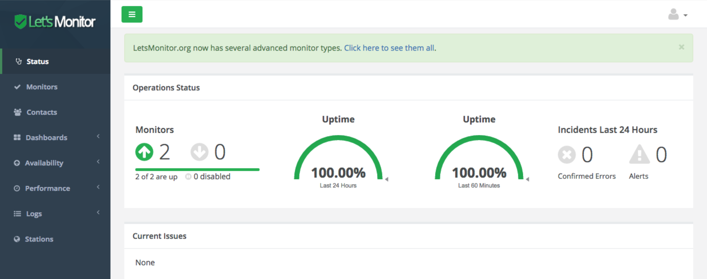

^ E.

---

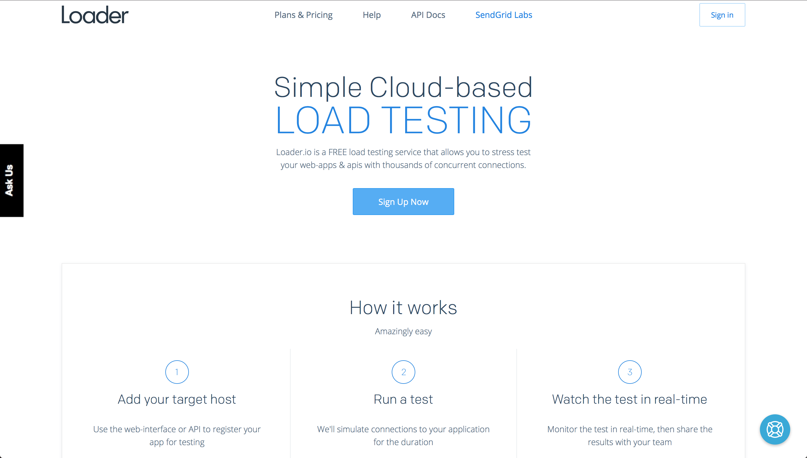

^ E.

---

# Issue

## How to centralize logs and exceptions?

^ G.

---


---


---

```php
// LogServiceProvider.php

/**
 * The papertrail log format.
 *
 * @var string
 */
protected $papertrailFormat = '%channel%.%level_name%: %message% %extra%';

/**
 * Configure the application's logging facilities.
 *
 * @return void
 */
public function boot()
{
    if ($this->app->environment('production', 'staging')) {
        $syslog = new \Monolog\Handler\SyslogHandler('laravel');
        $formatter = new \Monolog\Formatter\LineFormatter($this->papertrailFormat);

        $syslog->setFormatter($formatter);

        $this->app['log']->getMonolog()->pushHandler($syslog);
    }
}
```

---

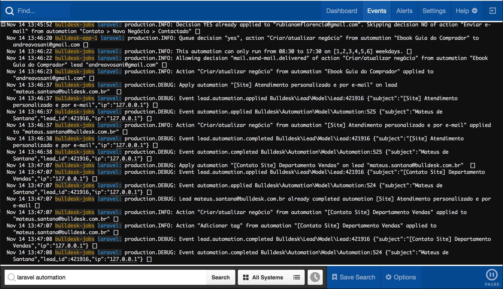

^ G.

---


^ G.

---

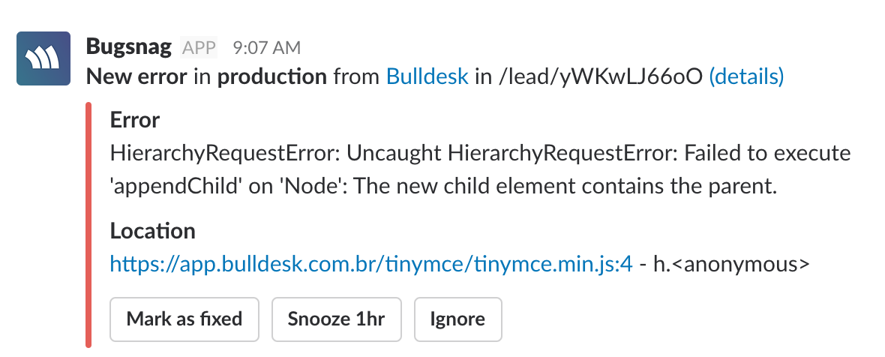

^ G.

---


---


^ G.

---

# Backups

```bash
$ composer require backup-manager/backup-manager

# OR
$ composer require backup-manager/laravel

# OR
$ composer require spatie/laravel-backup
```

^ G.
^ Na época instalei o backup-manager e não queria ficar refém de um package laravel por causa das atualizações / precisava de umas opções a mais para o backup do innoDB. Mas hoje acho que o melhor e mais configurável é o laravel-backup
^ E. uso bash.sh coloco senha no arquivo e mando pro S3

---

```php
(...)

/**
 * Execute the backup command.
 *
 * @return void
 */
public function handle()
{
    $database = $this->option('database') ?: 'mysql';
    $destination = $this->option('destination') ?: 's3';
    $destinationPath = 'dump_'. (new Carbon)->format('Y_m_d_H_i_s').'.sql';
    $compression = 'gzip';

    $this->info('Dumping database and uploading...');

    $destinations = [new Destination($destination, $destinationPath)];

    $this->backupProcedure->run($database, $destinations, $compression);

    $completePath = 'database/' . $destinationPath;

    $this->info(sprintf('Successfully dumped %s, compressed with %s and store it to %s at %s',
        $database,
        $compression,
        $destination,
        $completePath
    ));

    $last = new Carbon('last day of this month');

    // Delete file in 10 days if this not the last
    if ((new Carbon)->isSameAs('d/m/Y', $last)) {
        $this->info('Scheduled job to delete the backup file ' . $completePath . ' in 10 days.');

        dispatch((new DeleteFile($completePath . '.gz', 's3_backup'))->delay(24 * 60 * 60 * 10));
    }
}
```

---

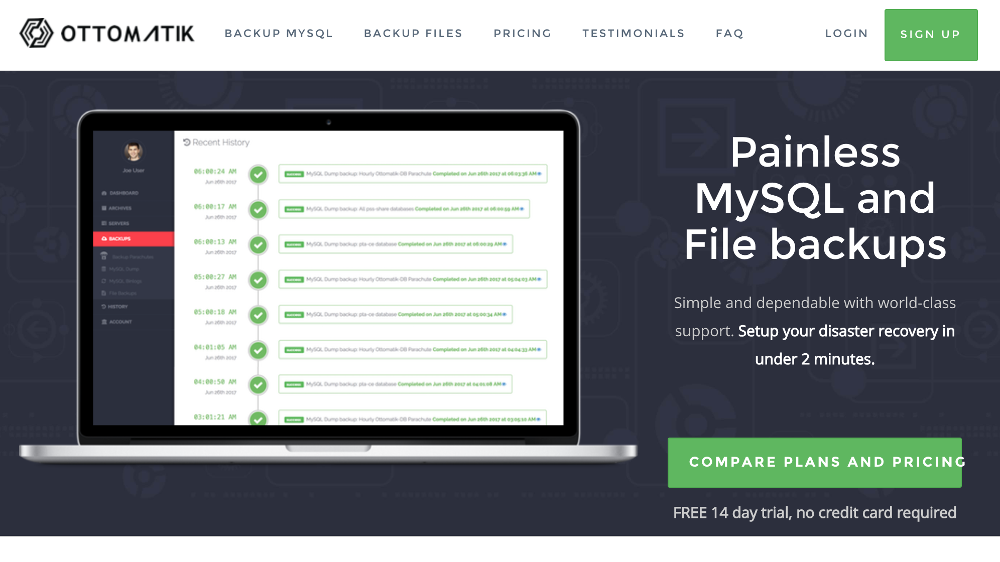

---


---

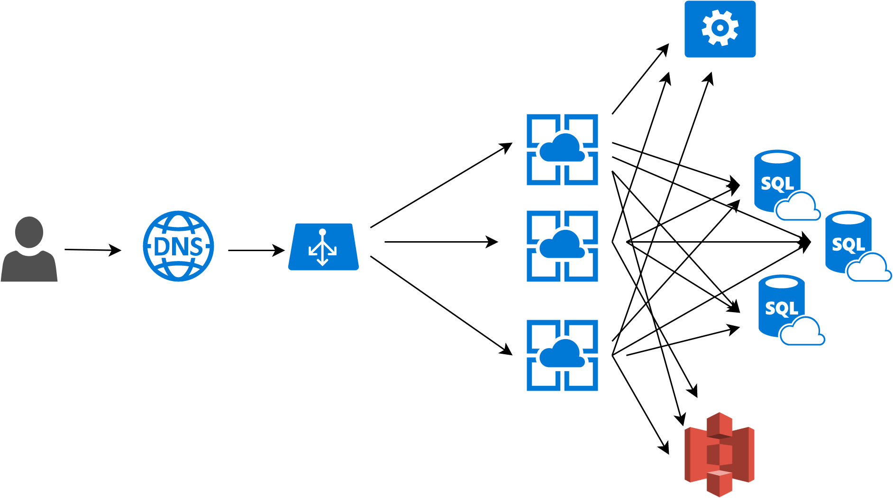

---

# Lessons Learned

---

# 1. Don't optimize or escalate prematurely, but be prepared for this.

^ E.

---

# 2. Don't create unnecessary abstractions.

^ G.

---

# 3. Use microservices only if you can maintain them.

^ E.

---

# 4. Study/learn alone and enjoy everything the internet gives you for free.

^ G.

---


---


 

 

 

 

---

# Thanks!

---

# We are hiring!

<br>
# Questions?

<br>
[bulldesk.com.br](bulldesk.com.br)
[gabriel@bulldesk.com.br](mailto:gabriel@bulldesk.com.br)
[twitter.com/gabrielmkoerich](https://twitter.com/gabrielmkoerich)

---

# Ref

[guides.github.com/introduction/flow](https://guides.github.com/introduction/flow)
<br>[github.com/gabrielkoerich/guidelines](https://github.com/gabrielkoerich/guidelines)
<br>[vessel.shippingdocker.com](vessel.shippingdocker.com)
<br>[docs.spatie.be/laravel-backup](https://docs.spatie.be/laravel-backup)
<br>[gabrielkoerich.com/talks/infra](https://gabrielkoerich.com/talks/infra)
